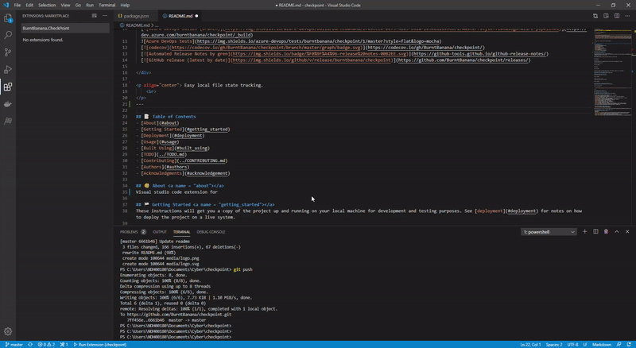

<p align="center">
  <a href="" rel="noopener">
 </a>
</p>

<h3 align="center">CheckPoint</h3>

<div align="center">

  [](https://dev.azure.com/burntbanana/checkpoint/_build)
  
  [](https://codecov.io/gh/BurntBanana/checkpoint/)
  [](https://github-tools.github.io/github-release-notes/)
  [](https://github.com/BurntBanana/checkpoint/releases/)
  
</div>

---

<p align="center"> Easy local file state tracking.
    <br> 
</p>

## 📝 Table of Contents
- [About](#about)
- [Getting Started](#getting_started)
- [Deployment](#deployment)
- [Usage](#usage)
- [Built Using](#built_using)
- [TODO](../TODO.md)
- [Contributing](../CONTRIBUTING.md)
- [Authors](#authors)
- [Acknowledgments](#acknowledgement)

## 🧐 About <a name = "about"></a>
Write about 1-2 paragraphs describing the purpose of your project.

## 🏁 Getting Started <a name = "getting_started"></a>
These instructions will get you a copy of the project up and running on your local machine for development and testing purposes. See [deployment](#deployment) for notes on how to deploy the project on a live system.

### Prerequisites
What things you need to install the software and how to install them.

```
Give examples
```

### Installing
A step by step series of examples that tell you how to get a development env running.

Say what the step will be

```
Give the example
```

And repeat

```
until finished
```

End with an example of getting some data out of the system or using it for a little demo.

## 🔧 Running the tests <a name = "tests"></a>
Explain how to run the automated tests for this system.

### Break down into end to end tests
Explain what these tests test and why

```
Give an example
```

### And coding style tests
Explain what these tests test and why

```
Give an example
```

## ☂ Code Coverage <a name = "code_coverage"></a>
Explain how to run the automated tests for this system.

### Code coverage graph

<div align="center">
  
  [](https://codecov.io/gh/BurntBanana/checkpoint/)

</div>

## 🎈 Usage <a name="usage"></a>
Add notes about how to use the system.

## 🚀 Deployment <a name = "deployment"></a>
Add additional notes about how to deploy this on a live system.

## ⛏️ Built Using <a name = "built_using"></a>
- [Visual Studio Code](https://code.visualstudio.com/) - Code Editor
- [NodeJS](https://nodejs.org/en/) - Backend
- [Diff Patch Match](https://github.com/google/diff-match-patch) - File change computation
- [Mocha](https://mochajs.org/) - Tests
- [VSCode Extension Tester](https://github.com/redhat-developer/vscode-extension-tester) - UI tests
- [Istanbul](https://istanbul.js.org/) - Code Coverage
- [dateFormat](https://www.npmjs.com/package/dateformat) - Date Formatting
- [Winston](https://www.npmjs.com/package/winston) - Logging
- [Webpack](https://webpack.js.org/) - Code packing
- [Method Draw](https://editor.method.ac/) - SVG editor
- [codecov.io](https://codecov.io/) - Code coverage analysis
- [shields.io](https://shields.io/) - Badges
- [Azure DevOps](https://azure.microsoft.com/en-in/services/devops/) - Build & Release pipelines
- [Azure Boards](https://azure.microsoft.com/en-in/services/devops/boards/) - Work item tracking
- [gren](https://github.com/github-tools/github-release-notes) - Release Notes

## ✍️ Authors <a name = "authors"></a>
- [@adershmanoj](https://github.com/adershmanoj)
- [@alexthomas96](https://github.com/alexthomas96)

See also the list of [contributors](https://github.com/kylelobo/The-Documentation-Compendium/contributors) who participated in this project.

## 🎉 Acknowledgements <a name = "acknowledgement"></a>
- Hat tip to anyone whose code was used
- Inspiration
- References
- [Tree View base code](https://github.com/microsoft/vscode-extension-samples/tree/master/tree-view-sample)
- [Webpack base code](https://github.com/microsoft/vscode-extension-samples/tree/master/webpack-sample)
- [Icons & Logos (based off)](https://www.flaticon.com/authors/freepik)
- [Code coverage reference](https://github.com/aaronpowell/vscode-profile-switcher)
- [README Template](https://github.com/kylelobo/The-Documentation-Compendium/blob/master/en/README_TEMPLATES/Standard.md)
